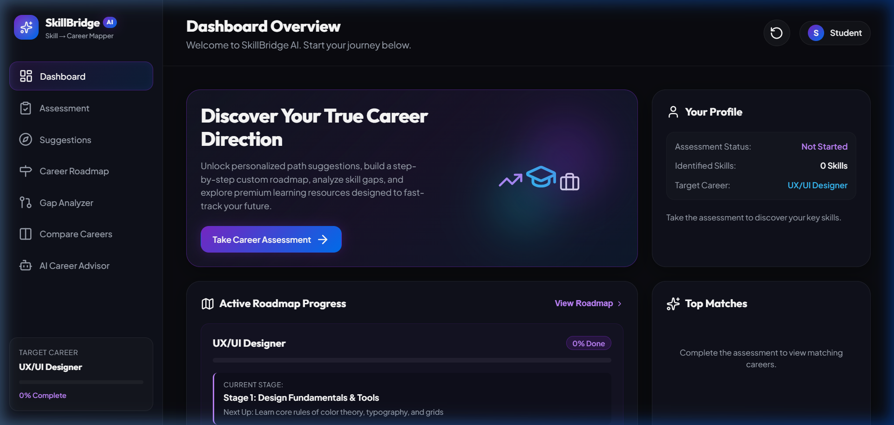
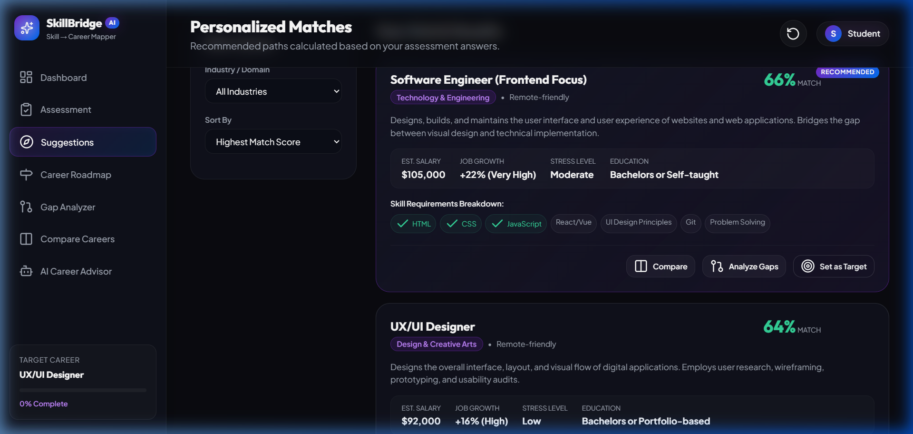
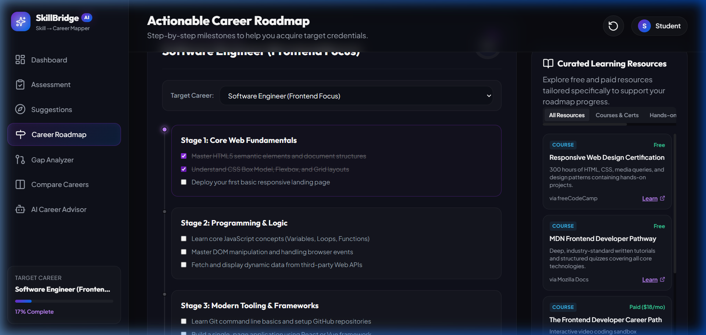
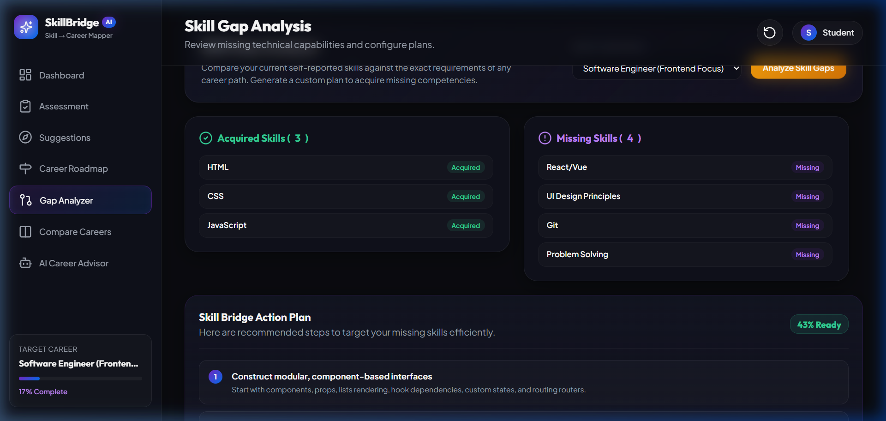
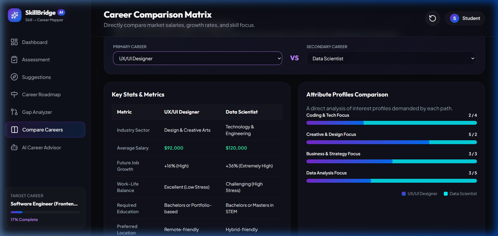
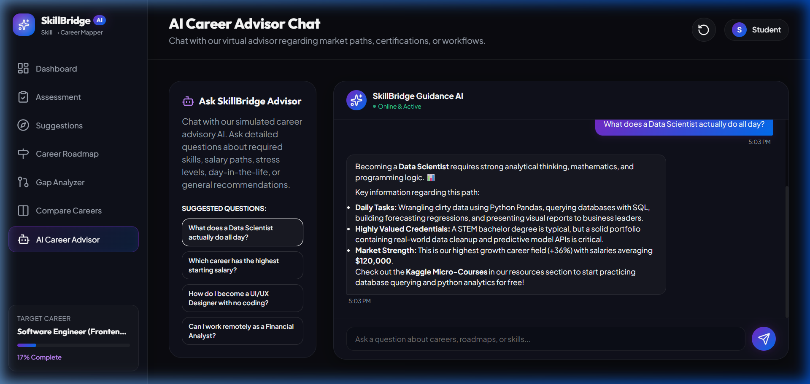

# 🌟 SkillBridge AI — Skill → Career Mapper

<div align="center">


**An AI-powered, fully interactive Single Page Application (SPA) that helps students discover their ideal career path based on their skills, interests and learning goals.**

[🚀 Live Demo](#) · [📖 Documentation](#how-it-works) · [🐛 Report Bug](https://github.com/vyshnavrachamdugu/SkillBridge-AI/issues) · [✨ Request Feature](https://github.com/vyshnavrachamdugu/SkillBridge-AI/issues)

</div>

---

## 📸 Application Workflow

### 1️⃣ Dashboard — Your Mission Control
> The main landing page showing your assessment status, active roadmap progress, and top career matches at a glance.

<p align="center">
  
</p>

---

### 2️⃣ Personalized Career Matches — AI Scoring Engine
> The matching algorithm scores each career using your interest profile, skill overlap, and environment preference to show tailored suggestions.

<p align="center">
  
</p>

---

### 3️⃣ Interactive Career Roadmap — Milestone Checklist
> Step-by-step milestone cards with interactive task checklists. Progress syncs live to the dashboard and sidebar.

<p align="center">
  
</p>

---

### 4️⃣ Skill Gap Analyzer — Readiness Calculator
> Compare your current skills against any target career and receive a personalized Skill Bridge Action Plan.

<p align="center">
  
</p>

---

### 5️⃣ Career Comparison Matrix — Side-by-Side Analytics
> Compare any two careers across industry, salary, growth, stress, location, and key attribute scores.

<p align="center">
  
</p>

---

### 6️⃣ AI Career Advisor — Simulated Chat Interface
> Ask freeform questions about careers, salaries, roadmaps, and skill strategies. The advisor replies with rich, detailed guidance.

<p align="center">
  
</p>

---

## ✨ Features

| Feature | Description |
|---|---|
| 🧠 **Career Interest Assessment** | 3-step wizard — interest sliders, skill chips, work-style selection |
| 🎯 **AI Match Scoring Engine** | Multi-dimensional scoring algorithm (interests + skills + environment) |
| 🗺️ **Interactive Career Roadmaps** | Stage-by-stage milestone checklists with real-time progress tracking |
| 📚 **Learning Resource Hub** | Curated free/paid courses, books, and hands-on project suggestions |
| 🔍 **Skill Gap Analyzer** | Delta calculation + personalized Skill Bridge Action Plan |
| 📊 **Career Comparison Matrix** | Side-by-side stats table + attribute profile bar charts |
| 🤖 **AI Career Advisor Chat** | Simulated chatbot with keyword-guided rich responses |
| 🏆 **Portfolio Builder** | Live resume preview that updates in real-time |
| ✅ **Skill Verification Quiz** | 3-question per-skill knowledge quizzes with pass/fail badges |
| 💾 **LocalStorage Persistence** | All state (answers, progress, target career) auto-saved across sessions |
| 🔔 **Toast Notifications** | Auto-appearing success/error alerts |
| 📥 **Resume Export** | One-click `.md` resume download with verified skill badges |

---

## 🗂️ Project Structure

```
SkillBridge-AI/
├── index.html          # Single Page Application shell, layout, all views & modal
├── styles.css          # Dark glassmorphism design system, animations, responsive CSS
├── app.js              # Career database, scoring engine, all interactive logic
└── README.md           # This file
```

---

## 🚀 Getting Started

### Prerequisites
- A modern web browser (Chrome, Firefox, Edge, Safari)
- Optionally: Python 3+ or Node.js (for local server)

### Running Locally

**Option 1: Python HTTP Server**
```bash
git clone https://github.com/vyshnavrachamdugu/SkillBridge-AI.git
cd SkillBridge-AI
python -m http.server 8000
# Open http://localhost:8000/
```

**Option 2: Node HTTP Server**
```bash
npx http-server .
# Open http://localhost:8080/
```

**Option 3: VS Code Live Server**
- Install the **Live Server** extension
- Right-click `index.html` → **Open with Live Server**

---

## 🧠 How It Works

### Match Scoring Algorithm
```
Match Score = Interest Score (70pts) + Skill Score (30pts) + Environment Bonus (5pts)

Interest Score:
  For each of 6 interest dimensions (Tech, Creative, Business, Health, Data, Social):
    diff = |userRating - careerIdealRating|
  interestScore = 70 - (totalDiff × 2.8)

Skill Score:
  matchedSkills = intersection(userSkills, careerRequiredSkills)
  skillScore = (matchedSkills.length / totalRequired) × 30

Environment Bonus:
  +2.5 if workStyle matches career.styleKey
  +2.5 if locationPreference matches career.locationKey
```

### Career Database
Currently includes **6 comprehensive careers** with full roadmaps, skills, resources, and interest profiles:

| Career | Domain | Avg Salary | Growth |
|---|---|---|---|
| Software Engineer (Frontend) | Technology | $105,000 | +22% |
| Data Scientist | Technology | $120,000 | +36% |
| UX/UI Designer | Design & Creative | $92,000 | +16% |
| Digital Marketing Manager | Business | $85,000 | +10% |
| Healthcare Informatics Analyst | Healthcare | $88,000 | +17% |
| Financial Analyst | Business & Finance | $96,000 | +9% |

---

## 🎨 Design System

```css
/* Core Theme Tokens */
--bg-dark:          #0a0b10     /* Main background */
--bg-card:          rgba(20, 22, 37, 0.55)  /* Glassmorphic card bg */
--accent-primary:   #8a2be2     /* Purple accent */
--accent-secondary: #00f2fe     /* Teal accent */
--text-accent:      #c084fc     /* Light purple text */
--text-success:     #34d399     /* Green success text */
--grad-primary:     linear-gradient(135deg, #7928ca, #0070f3)
```

**Typography:** [Outfit](https://fonts.google.com/specimen/Outfit) (headings) + [Plus Jakarta Sans](https://fonts.google.com/specimen/Plus+Jakarta+Sans) (body)

**Effects:** Glassmorphism (`backdrop-filter: blur(16px)`), neon glows, float animations, fade-in view transitions

---

## 🛠️ Tech Stack

| Technology | Purpose |
|---|---|
| **HTML5** | Semantic SPA structure, ARIA-friendly |
| **Vanilla CSS3** | Custom design system, animations, responsive layout |
| **Vanilla JavaScript (ES6+)** | All logic — no frameworks, no dependencies |
| **Lucide Icons** | Clean SVG icon library (CDN) |
| **Google Fonts** | Outfit + Plus Jakarta Sans typography |
| **localStorage API** | Cross-session state persistence |

---

## 📱 Responsive Design

| Breakpoint | Layout |
|---|---|
| `> 1200px` | Full 3-column dashboard + dual-panel views |
| `992px–1200px` | 2-column layout, stacked panels |
| `< 992px` | Collapsed sidebar (icons only), single-column |
| `< 600px` | Full mobile layout, stacked cards |

---

## 🤝 Contributing

1. Fork the Project
2. Create your Feature Branch (`git checkout -b feature/AmazingFeature`)
3. Commit your Changes (`git commit -m 'Add some AmazingFeature'`)
4. Push to the Branch (`git push origin feature/AmazingFeature`)
5. Open a Pull Request

---

## 📄 License

Distributed under the MIT License. See `LICENSE` for more information.

---

## 👤 Author

**Vyshnav Rachamdugu**
- GitHub: [@vyshnavrachamdugu](https://github.com/vyshnavrachamdugu)

---

## 🙏 Acknowledgments

- [Lucide Icons](https://lucide.dev/) — SVG icon library
- [Google Fonts](https://fonts.google.com/) — Outfit & Plus Jakarta Sans
- Career data inspired by [Bureau of Labor Statistics](https://www.bls.gov/ooh/) and [Glassdoor](https://www.glassdoor.com/)

---

<div align="center">
Made with ❤️ by Vyshnav Rachamdugu · SkillBridge AI — Empowering Students to Find Their Careers
</div>
