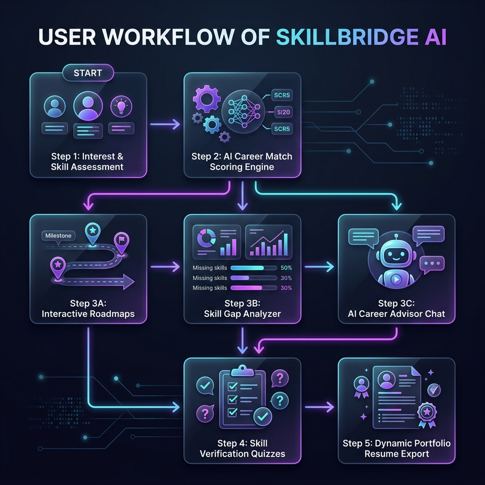
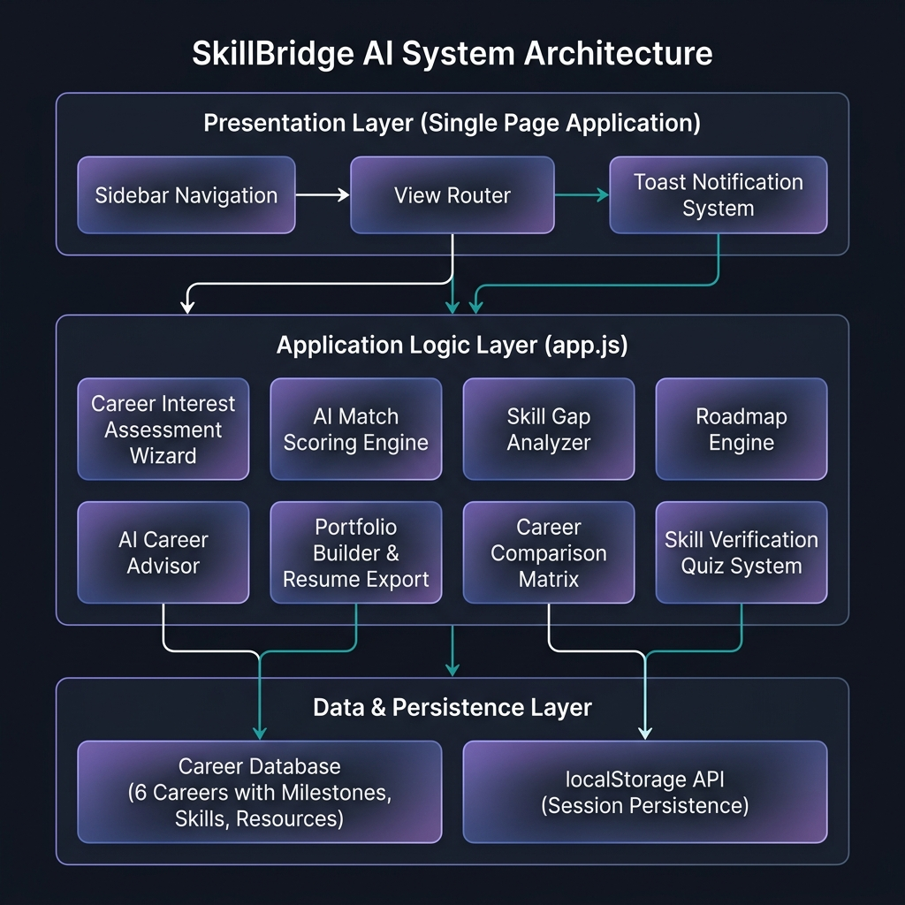

# 🌟 SkillBridge AI — Skill → Career Mapper

<div align="center">


**An AI-powered, fully interactive Single Page Application (SPA) that helps students discover their ideal career path based on their skills, interests and learning goals.**

[🚀 Live Demo](#) · [📖 Documentation](#how-it-works) · [🐛 Report Bug](https://github.com/vyshnavrachamdugu/SkillBridge-AI/issues) · [✨ Request Feature](https://github.com/vyshnavrachamdugu/SkillBridge-AI/issues)

</div>

---

## 📋 Table of Contents

- [Problem Statement](#-problem-statement)
- [Solution](#-solution)
- [Application Workflow](#-application-workflow)
- [System Architecture](#-system-architecture)
- [Features](#-features)
- [Screenshots](#-screenshots)
- [Getting Started](#-getting-started)
- [How It Works](#-how-it-works)
- [Tech Stack](#️-tech-stack)
- [Design System](#-design-system)
- [Responsive Design](#-responsive-design)
- [Project Structure](#️-project-structure)
- [Contributing](#-contributing)
- [License](#-license)
- [Author](#-author)
- [Acknowledgments](#-acknowledgments)

---

## 🔴 Problem Statement

Choosing the right career is one of the most impactful decisions a student makes — yet the process is overwhelmingly confusing, fragmented, and deeply personal:

| Challenge | Impact |
|---|---|
| **Information Overload** | Students face hundreds of career options with no structured way to filter or rank them against their unique profile. |
| **Skill-Career Mismatch** | There is no easy tool to map a student's *existing* skills to *specific* career requirements and quantify the gap. |
| **No Personalized Roadmaps** | Generic career advice fails to account for individual starting points — students don't know *what* to learn or *in what order*. |
| **Fragmented Resources** | Useful learning materials (courses, books, projects) are scattered across the web with no curation by career relevance. |
| **No Feedback Loop** | Students have no way to verify whether they've actually acquired skills or track meaningful progress toward career readiness. |
| **Costly Guidance** | Professional career counseling is expensive and inaccessible for many students, especially those from underserved backgrounds. |

> **In short:** Students need a free, intelligent, all-in-one platform that connects *who they are* (skills + interests) to *where they should go* (career paths) and *how to get there* (actionable learning roadmaps with progress tracking).

---

## 💡 Solution

**SkillBridge AI** solves this by providing a fully client-side, zero-dependency, AI-powered career guidance platform that takes students from *"I don't know what career to pursue"* to *"I have a verified skill portfolio and a clear roadmap."*

### How SkillBridge AI Addresses Each Problem

| Problem | SkillBridge AI Solution |
|---|---|
| Information Overload | **AI Match Scoring Engine** — Ranks careers by a multi-dimensional percentage score (interests + skills + environment), surfacing only the most relevant options. |
| Skill-Career Mismatch | **Skill Gap Analyzer** — Performs delta analysis between current skills and target career requirements, outputting a concrete bridging action plan. |
| No Personalized Roadmaps | **Interactive Career Roadmap** — Generates stage-by-stage milestone checklists with real-time progress tracking, customized per career path. |
| Fragmented Resources | **Curated Learning Hub** — Every career path comes bundled with vetted free/paid courses, books, and hands-on project recommendations. |
| No Feedback Loop | **Skill Verification Quizzes + Portfolio Builder** — Students prove competency through quizzes, earn verification badges, and export a professional resume. |
| Costly Guidance | **AI Career Advisor Chat** — A simulated chatbot providing rich, keyword-guided career guidance — 100% free, no login required. |

### Key Design Principles

- **🔒 Privacy-First** — No backend, no accounts, no data collection. All data lives in `localStorage` on the student's own device.
- **⚡ Zero Dependencies** — Pure HTML + CSS + JS. No npm, no build steps, no frameworks. Opens in any browser instantly.
- **🎨 Premium UX** — Dark glassmorphic design system with smooth animations, neon accents, and fully responsive layouts.
- **♿ Accessible** — Semantic HTML5, ARIA-friendly navigation, keyboard-navigable interface.

---

## 📸 Application Workflow

To help students navigate from initial career uncertainty to a professional verified resume, SkillBridge AI maps out a structured 4-phase user journey.

<p align="center">
  
</p>

### 🗺️ The 4-Phase Student Success Path

```
┌────────────────────────┐      ┌────────────────────────┐      ┌────────────────────────┐      ┌────────────────────────┐
│  1. Input & Profiling  │ ───> │ 2. Similarity Engine   │ ───> │  3. Active Roadmap &   │ ───> │  4. Verify & Export   │
│  (Interest Assessment) │      │ (AI Match Score Calc)  │      │  Analytics Dashboard   │      │ (Quizzes & Portfolio)  │
└────────────────────────┘      └────────────────────────┘      └────────────────────────┘      └────────────────────────┘
```

1. **Phase 1: Input & Profiling (Assessment Wizard)**
   Students input their core competencies, evaluate their interests across 6 dimensions, and set their work preferences (remote vs. hybrid, collaborative vs. focused).
2. **Phase 2: AI Match Scoring Engine**
   The application matches the student's profile against the career database using interest similarity calculations, skill overlaps, and environmental preferences to rank matches by percentage score.
3. **Phase 3: Roadmapping & Skill Gap Analysis**
   Once a target career is chosen, students get:
   - An **interactive checklist roadmap** broken into developmental milestones.
   - A **Skill Gap Analyzer** that isolates missing technical elements and generates a customized bridging plan.
   - An **AI Career Advisor** for interactive, guidance-based conversation.
4. **Phase 4: Skill Verification & Resume Export**
   Students test their knowledge via interactive **Skill Quizzes**. Passing results add permanent verification badges to their dynamic profile card, which can be downloaded as a Markdown resume.

---

## 🏗️ System Architecture

<p align="center">
  
</p>

SkillBridge AI follows a **layered client-side architecture** with clear separation of concerns:

### Presentation Layer (index.html + styles.css)
```
┌─────────────────────────────────────────────────────────────────┐
│                     Single Page Application                     │
│  ┌──────────────┐  ┌─────────────────┐  ┌───────────────────┐  │
│  │   Sidebar    │  │  View Router    │  │  Toast System     │  │
│  │  Navigation  │  │ (Tab Switching) │  │ (Notifications)   │  │
│  └──────────────┘  └─────────────────┘  └───────────────────┘  │
└─────────────────────────────────────────────────────────────────┘
```
- Tab-based SPA navigation — no page reloads
- 8 view panes managed by a custom `switchTab()` router
- Glassmorphic dark-mode design system with CSS custom properties

### Application Logic Layer (app.js)
```
┌─────────────────────────────────────────────────────────────────┐
│                     Core Engine Modules                         │
│  ┌───────────────────┐  ┌─────────────────────────────────┐    │
│  │ Assessment Wizard │  │  AI Match Scoring Engine         │    │
│  │ (3-step profiler) │  │  (Interest + Skill + Env Score)  │    │
│  └───────────────────┘  └─────────────────────────────────┘    │
│  ┌───────────────────┐  ┌─────────────────────────────────┐    │
│  │ Roadmap Engine    │  │  Skill Gap Analyzer              │    │
│  │ (Milestone CRUD)  │  │  (Delta Calc + Action Plan)      │    │
│  └───────────────────┘  └─────────────────────────────────┘    │
│  ┌───────────────────┐  ┌─────────────────────────────────┐    │
│  │ AI Career Advisor │  │  Career Comparison Matrix        │    │
│  │ (Keyword NLP)     │  │  (Side-by-Side Analytics)        │    │
│  └───────────────────┘  └─────────────────────────────────┘    │
│  ┌───────────────────┐  ┌─────────────────────────────────┐    │
│  │ Skill Quiz System │  │  Portfolio & Resume Builder      │    │
│  │ (Verify + Badge)  │  │  (Dynamic Card + MD Export)      │    │
│  └───────────────────┘  └─────────────────────────────────┘    │
└─────────────────────────────────────────────────────────────────┘
```
- All 8 modules are self-contained within a single `app.js` file
- Event-driven architecture with DOM event delegation
- State managed via a central object synced to `localStorage`

### Data & Persistence Layer
```
┌─────────────────────────────────────────────────────────────────┐
│  ┌──────────────────────────────┐  ┌────────────────────────┐  │
│  │   CAREER_DATABASE (const)   │  │   localStorage API     │  │
│  │  6 careers × full profiles  │  │  Assessment answers    │  │
│  │  Milestones & task lists    │  │  Target career state   │  │
│  │  Learning resources (URLs)  │  │  Roadmap progress      │  │
│  │  Interest ideal vectors     │  │  Quiz results & badges │  │
│  │  Skill requirement arrays   │  │  Portfolio data        │  │
│  └──────────────────────────────┘  └────────────────────────┘  │
└─────────────────────────────────────────────────────────────────┘
```
- **CAREER_DATABASE**: In-memory JavaScript object containing 6 comprehensive career profiles with milestones, skills, ideal interest vectors, and curated resources
- **localStorage**: Browser-native key-value persistence for all user state — survives page reloads and browser restarts

---

## ✨ Features

| Feature | Description |
|---|---|
| 🧠 **Career Interest Assessment** | 3-step wizard — interest sliders, skill chips, work-style selection |
| 🎯 **AI Match Scoring Engine** | Multi-dimensional scoring algorithm (interests + skills + environment) |
| 🗺️ **Interactive Career Roadmaps** | Stage-by-stage milestone checklists with real-time progress tracking |
| 📚 **Learning Resource Hub** | Curated free/paid courses, books, and hands-on project suggestions |
| 🔍 **Skill Gap Analyzer** | Delta calculation + personalized Skill Bridge Action Plan |
| 📊 **Career Comparison Matrix** | Side-by-side stats table + attribute profile bar charts |
| 🤖 **AI Career Advisor Chat** | Simulated chatbot with keyword-guided rich responses |
| 🏆 **Portfolio Builder** | Live resume preview that updates in real-time |
| ✅ **Skill Verification Quiz** | 3-question per-skill knowledge quizzes with pass/fail badges |
| 💾 **LocalStorage Persistence** | All state (answers, progress, target career) auto-saved across sessions |
| 🔔 **Toast Notifications** | Auto-appearing success/error alerts |
| 📥 **Resume Export** | One-click `.md` resume download with verified skill badges |

---

## 📸 Screenshots

### 1️⃣ Dashboard — Your Mission Control
> The main landing page showing your assessment status, active roadmap progress, and top career matches at a glance.

<p align="center">
  
</p>

---

### 2️⃣ Personalized Career Matches — AI Scoring Engine
> The matching algorithm scores each career using your interest profile, skill overlap, and environment preference to show tailored suggestions.

<p align="center">
  
</p>

---

### 3️⃣ Interactive Career Roadmap — Milestone Checklist
> Step-by-step milestone cards with interactive task checklists. Progress syncs live to the dashboard and sidebar.

<p align="center">
  
</p>

---

### 4️⃣ Skill Gap Analyzer — Readiness Calculator
> Compare your current skills against any target career and receive a personalized Skill Bridge Action Plan.

<p align="center">
  
</p>

---

### 5️⃣ Career Comparison Matrix — Side-by-Side Analytics
> Compare any two careers across industry, salary, growth, stress, location, and key attribute scores.

<p align="center">
  
</p>

---

### 6️⃣ AI Career Advisor — Simulated Chat Interface
> Ask freeform questions about careers, salaries, roadmaps, and skill strategies. The advisor replies with rich, detailed guidance.

<p align="center">
  
</p>

---

## 🚀 Getting Started

### Prerequisites

| Requirement | Details |
|---|---|
| **Browser** | Any modern browser — Chrome, Firefox, Edge, or Safari |
| **Server (optional)** | Python 3+, Node.js, or VS Code Live Server extension |

> **Note:** SkillBridge AI is a fully client-side application. You can open `index.html` directly in a browser — no server or internet connection is strictly required (though Google Fonts and Lucide Icons are loaded via CDN).

### Installation & Setup

#### Step 1: Clone the Repository
```bash
git clone https://github.com/vyshnavrachamdugu/SkillBridge-AI.git
cd SkillBridge-AI
```

#### Step 2: Launch the Application

Choose any of the following methods:

**Option A: Python HTTP Server (Recommended)**
```bash
python -m http.server 8000
```
Then open [http://localhost:8000](http://localhost:8000) in your browser.

**Option B: Node.js HTTP Server**
```bash
npx http-server .
```
Then open [http://localhost:8080](http://localhost:8080) in your browser.

**Option C: VS Code Live Server**
1. Install the [Live Server](https://marketplace.visualstudio.com/items?itemName=ritwickdey.LiveServer) extension
2. Right-click `index.html` → **Open with Live Server**
3. The app opens automatically at `http://127.0.0.1:5500`

**Option D: Direct File Open**
```bash
# Simply double-click index.html, or:
start index.html        # Windows
open index.html         # macOS
xdg-open index.html     # Linux
```

#### Step 3: Use the Application

1. **Take the Assessment** — Click *"Take Career Assessment"* on the dashboard to begin the 3-step profiling wizard.
2. **Explore Matches** — View your AI-ranked career suggestions with percentage match scores.
3. **Set a Target Career** — Click *"Set as Target"* on any career to unlock the roadmap, gap analyzer, and learning resources.
4. **Track Progress** — Check off roadmap milestones and watch your progress update across the dashboard and sidebar.
5. **Verify Skills** — Take skill quizzes to earn verification badges on your portfolio card.
6. **Export Resume** — Download your dynamic profile as a Markdown resume file.

---

## 🧠 How It Works

### Match Scoring Algorithm

The AI scoring engine uses a **multi-dimensional similarity calculation** to rank careers:

```
Match Score = Interest Score (70pts) + Skill Score (30pts) + Environment Bonus (5pts)

Interest Score:
  For each of 6 interest dimensions (Tech, Creative, Business, Health, Data, Social):
    diff = |userRating - careerIdealRating|
  interestScore = 70 - (totalDiff × 2.8)

Skill Score:
  matchedSkills = intersection(userSkills, careerRequiredSkills)
  skillScore = (matchedSkills.length / totalRequired) × 30

Environment Bonus:
  +2.5 if workStyle matches career.styleKey
  +2.5 if locationPreference matches career.locationKey
```

**Why this works:** The 70/30/5 weighting reflects that career satisfaction correlates most strongly with *interest alignment*, followed by *existing competency*, with *work environment* as a secondary booster. Scores are capped at 105 to allow exceptional matches to stand out.

### Career Database

Currently includes **6 comprehensive careers** with full roadmaps, skills, resources, and interest profiles:

| Career | Domain | Avg Salary | Growth |
|---|---|---|---|
| Software Engineer (Frontend) | Technology | $105,000 | +22% |
| Data Scientist | Technology | $120,000 | +36% |
| UX/UI Designer | Design & Creative | $92,000 | +16% |
| Digital Marketing Manager | Business | $85,000 | +10% |
| Healthcare Informatics Analyst | Healthcare | $88,000 | +17% |
| Financial Analyst | Business & Finance | $96,000 | +9% |

Each career includes:
- ✅ Ideal interest vector (6 dimensions)
- ✅ Required skill list
- ✅ 4-stage milestone roadmap with 12 actionable tasks
- ✅ Curated learning resources with URLs
- ✅ Salary, growth, stress, and location metadata

---

## 🛠️ Tech Stack

| Technology | Purpose |
|---|---|
| **HTML5** | Semantic SPA structure, ARIA-friendly |
| **Vanilla CSS3** | Custom design system, animations, responsive layout |
| **Vanilla JavaScript (ES6+)** | All logic — no frameworks, no dependencies |
| **Lucide Icons** | Clean SVG icon library (CDN) |
| **Google Fonts** | Outfit + Plus Jakarta Sans typography |
| **localStorage API** | Cross-session state persistence |

> **Zero external dependencies.** No npm packages, no build tools, no frameworks. The entire application runs from 3 files.

---

## 🎨 Design System

```css
/* Core Theme Tokens */
--bg-dark:          #0a0b10     /* Main background */
--bg-card:          rgba(20, 22, 37, 0.55)  /* Glassmorphic card bg */
--accent-primary:   #8a2be2     /* Purple accent */
--accent-secondary: #00f2fe     /* Teal accent */
--text-accent:      #c084fc     /* Light purple text */
--text-success:     #34d399     /* Green success text */
--grad-primary:     linear-gradient(135deg, #7928ca, #0070f3)
```

**Typography:** [Outfit](https://fonts.google.com/specimen/Outfit) (headings) + [Plus Jakarta Sans](https://fonts.google.com/specimen/Plus+Jakarta+Sans) (body)

**Effects:** Glassmorphism (`backdrop-filter: blur(16px)`), neon glows, float animations, fade-in view transitions

---

## 📱 Responsive Design

| Breakpoint | Layout |
|---|---|
| `> 1200px` | Full 3-column dashboard + dual-panel views |
| `992px–1200px` | 2-column layout, stacked panels |
| `< 992px` | Collapsed sidebar (icons only), single-column |
| `< 600px` | Full mobile layout, stacked cards |

---

## 🗂️ Project Structure

```
SkillBridge-AI/
├── index.html          # Single Page Application shell, layout, all views & modals
├── styles.css          # Dark glassmorphism design system, animations, responsive CSS
├── app.js              # Career database, scoring engine, all interactive logic
├── assets/             # Screenshots and diagrams
│   ├── architecture.png    # System architecture diagram
│   ├── workflow.png        # User journey workflow diagram
│   ├── dashboard.png       # Dashboard screenshot
│   ├── matches.png         # Career matches screenshot
│   ├── roadmap.png         # Roadmap screenshot
│   ├── gap_analyzer.png    # Skill gap analyzer screenshot
│   ├── compare.png         # Career comparison screenshot
│   └── ai_advisor.png      # AI advisor screenshot
├── .gitignore          # Git ignore rules
└── README.md           # This documentation file
```

---

## 🤝 Contributing

Contributions are welcome! Here's how:

1. **Fork** the project
2. **Create** your feature branch (`git checkout -b feature/AmazingFeature`)
3. **Commit** your changes (`git commit -m 'Add some AmazingFeature'`)
4. **Push** to the branch (`git push origin feature/AmazingFeature`)
5. **Open** a Pull Request

---

## 📄 License

Distributed under the MIT License. See `LICENSE` for more information.

---

## 👤 Author

**Vyshnav Rachamdugu**
- GitHub: [@vyshnavrachamdugu](https://github.com/vyshnavrachamdugu)

---

## 🙏 Acknowledgments

- [Lucide Icons](https://lucide.dev/) — SVG icon library
- [Google Fonts](https://fonts.google.com/) — Outfit & Plus Jakarta Sans
- Career data inspired by [Bureau of Labor Statistics](https://www.bls.gov/ooh/) and [Glassdoor](https://www.glassdoor.com/)

---

<div align="center">
Made with ❤️ by Vyshnav Rachamdugu · SkillBridge AI — Empowering Students to Find Their Careers
</div>
